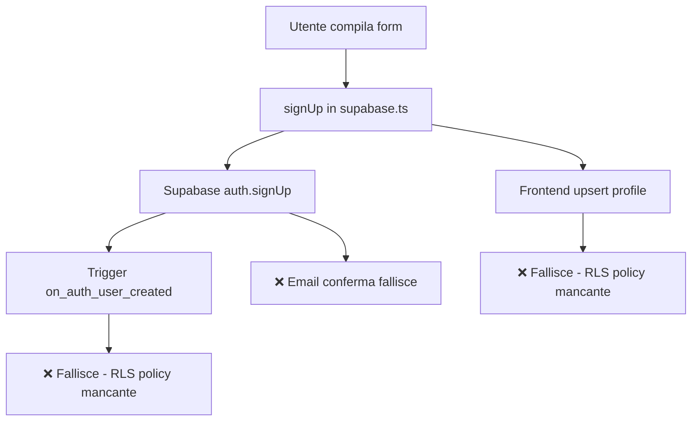

# 🔍 AUDIT SISTEMA REGISTRAZIONE MIKY.AI

## 📅 Data Audit: 26 Agosto 2025

## 🔴 PROBLEMI CRITICI IDENTIFICATI

### 1. **Database Schema Issues**
- ❌ Mancano campi essenziali nella tabella `profiles`:
  - `email_verified` (BOOLEAN)
  - `verification_token` (TEXT)
  - `verification_token_expires` (TIMESTAMP)
- ❌ Mancanza di policy INSERT per la tabella `profiles`
- ⚠️ Conflitto tra trigger automatico e creazione manuale del profilo

### 2. **Row Level Security (RLS) Policies**
```sql
-- PROBLEMA: Non c'è policy INSERT per profiles!
-- Attualmente esistono solo:
- SELECT: "Users can view their own profile"
- UPDATE: "Users can update their own profile"
- ALL: "Admins can view all profiles"
```

### 3. **Email Configuration Issues**
- ❌ Email di conferma non configurata correttamente in Supabase
- ❌ Nessun sistema per inviare email a support@miky.ai per nuove registrazioni
- ❌ L'API `/api/auth/verify` si aspetta campi che non esistono nel DB

### 4. **Frontend/Backend Mismatch**
- Il codice frontend cerca di creare il profilo manualmente
- Il database ha un trigger che dovrebbe crearlo automaticamente
- Duplicazione di logica che causa conflitti

## 📊 FLUSSO ATTUALE (ROTTO)



## ✅ REQUISITI PER LA REGISTRAZIONE

### Dati Utente Necessari:
1. **Campi base**:
   - Email
   - Password
   - Nome completo
   - Codice referral (opzionale)

2. **Campi auto-generati**:
   - ID (UUID)
   - Referral code univoco
   - Credits iniziali (100)
   - Water cleaned (0)
   - Subscription plan (free)
   - Language (en)

3. **Tracking referral**:
   - referred_by (codice di chi ha invitato)
   - referral_level (livello nella rete)

### Email da Inviare:
1. **Email di conferma** → Utente
2. **Notifica nuova registrazione** → support@miky.ai

## 🛠️ SOLUZIONI PROPOSTE

### 1. **Fix Database Schema**
```sql
-- Aggiungere campi mancanti
ALTER TABLE profiles ADD COLUMN IF NOT EXISTS email_verified BOOLEAN DEFAULT false;
ALTER TABLE profiles ADD COLUMN IF NOT EXISTS verification_token TEXT;
ALTER TABLE profiles ADD COLUMN IF NOT EXISTS verification_token_expires TIMESTAMP WITH TIME ZONE;

-- Aggiungere policy INSERT
CREATE POLICY "Service role can insert profiles" ON profiles
FOR INSERT WITH CHECK (true);

-- O meglio, permettere agli utenti di creare il proprio profilo
CREATE POLICY "Users can insert their own profile" ON profiles
FOR INSERT WITH CHECK (auth.uid() = id);
```

### 2. **Configurazione Email Supabase**
- Configurare SMTP in Supabase Dashboard
- O usare SendGrid/Resend per gestione email custom

### 3. **Semplificare il Flusso**
- Rimuovere duplicazione tra trigger e frontend
- Usare SOLO il trigger per creare il profilo base
- Frontend fa solo update per dati aggiuntivi

### 4. **Implementare Email Service**
- Configurare SendGrid con API key
- Template per email di conferma
- Template per notifica admin

## 📝 PRIORITÀ IMPLEMENTAZIONE

1. **IMMEDIATO**: Fix RLS policies
2. **URGENTE**: Aggiungere campi mancanti al DB
3. **IMPORTANTE**: Configurare email service
4. **NICE TO HAVE**: Migliorare UX con messaggi di errore

## 🚨 ERRORI CONSOLE IDENTIFICATI

```
- Error 403: Forbidden (RLS policy violation)
- Error 406: Not Acceptable (campo mancante)
- Error 500: Server error (API route failure)
- "Error sending confirmation email"
```

## 📌 NOTE TECNICHE

- Supabase Auth gestisce automaticamente l'invio email SE configurato
- Il trigger `on_auth_user_created` viene eseguito DOPO la creazione in auth.users
- Le policy RLS devono permettere INSERT per funzionare correttamente
- SendGrid richiede verificazione del dominio per funzionare in produzione
